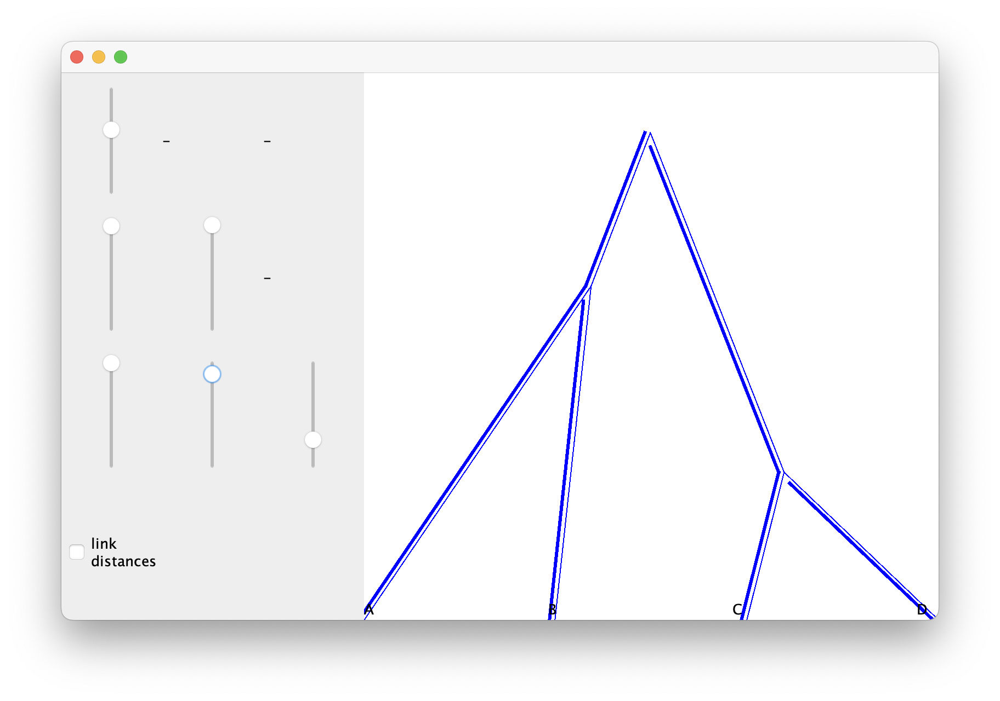
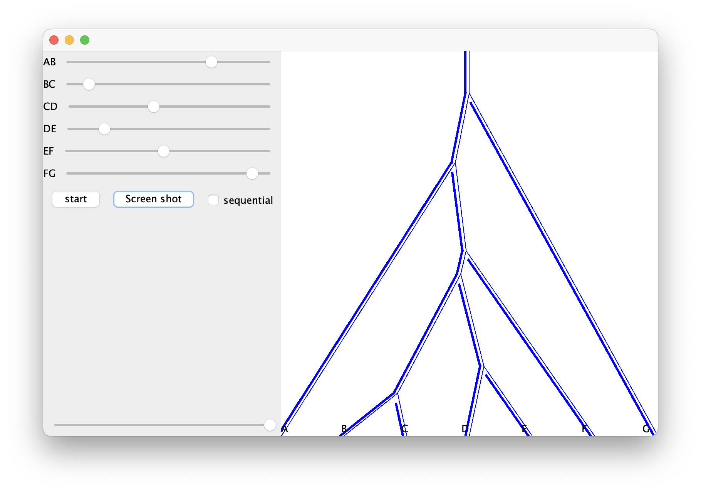

# CubeVB

This is a package for [BEAST 2](http://beast2.org) for variational Bayes on a cube.

It also contains a Matrix based summary tree topology provider that works with TreeAnnotator in BEAST v2.7.6.


## Installing

Install [BEAST 2](http://beast2.org).

Download [CubeVB.v1.0.2.zip](https://github.com/rbouckaert/cubevb/releases/download/v1.0.0/CubeVB.v1.0.2.zip). 
Then, create a CubeVB subdirectory:

```
for Windows in Users\<YourName>\BEAST\2.7\CubeVB
for Mac in /Users/<YourName>\/Library/Application Support/BEAST/2.7/CubeVB
for Linux /home/<YourName>/.beast/2.7/CubeVB
```

Here `<YourName>` is the username you use.
Unzip the file [CubeVB.v1.0.2.zip](https://github.com/rbouckaert/cubevb/releases/download/v1.0.0/CubeVB.v1.0.2.zip) in the newly created directory.


## Build from code

An alternative way to install is to build from the source code. 
Frist, get code for beast2, BeastFX and CubeVB. Then run

```
ant install
```

to install the package.

## Visualising matrix space

The `MatrixTreeViewer` app that comes with this package allows you to change a distance matrix for a 4 taxon tree.

To launch, use the applauncher tool that comes with BEAST, or via the BEAUti using the <<File/Launch apps>> menu, or via the command line using:

```
/path/to/beast/bin/appplauncher MatrixTreeViewer
```



## Visualising cube space


The `CubeTreeViewer` app that comes with this package allows you to change a distance cube for a 6 taxon tree.

To launch, use the applauncher tool that comes with BEAST, or via the BEAUti using the <<File/Launch apps>> menu, or via the command line using:

```
/path/to/beast/bin/appplauncher CubeTreeViewer
```




## Paper

Remco R. Bouckaert.
Variational Bayesian Phylogenies through Matrix Representation of Tree Space
2023 (https://www.biorxiv.org/content/10.1101/2023.10.19.563180).

## Data

Data used in the paper:


* [tree.tgz](https://github.com/rbouckaert/cubevb/releases/download/v1.0.0/trees.tgz) : trees used in Section 3 of the paper
* [wcss.tgz](https://github.com/rbouckaert/cubevb/releases/download/v1.0.0/wcss.tgz) : ground truth + BEAST XML + summary log files for well calibrated simulation study of Section 3.2 of the paper
* [performance.tgz](https://github.com/rbouckaert/cubevb/releases/download/v1.0.0/performance.tgz) : ground truth + BEAST XML + summary log for performance measurement used in section 3.3 of the paper
